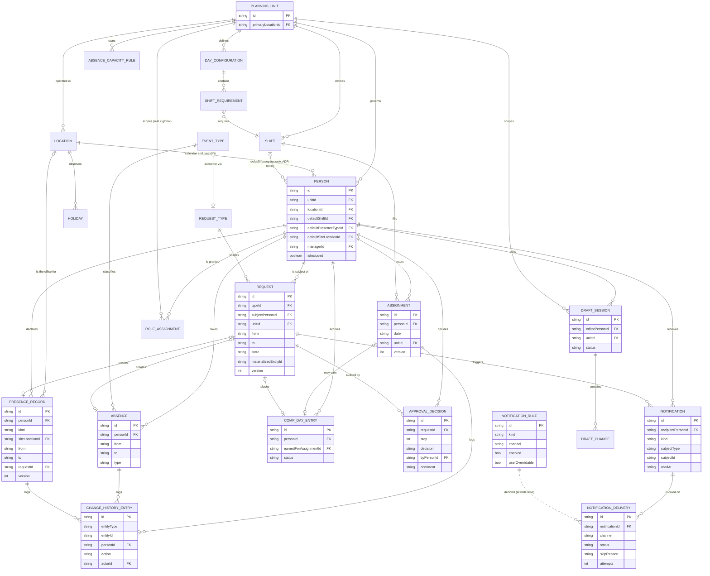
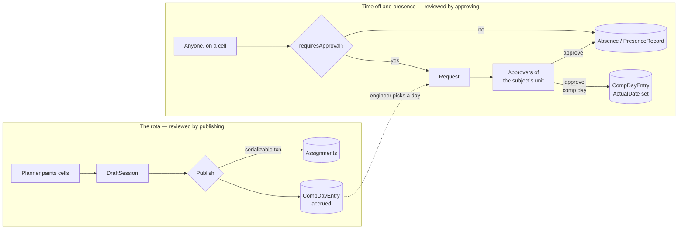
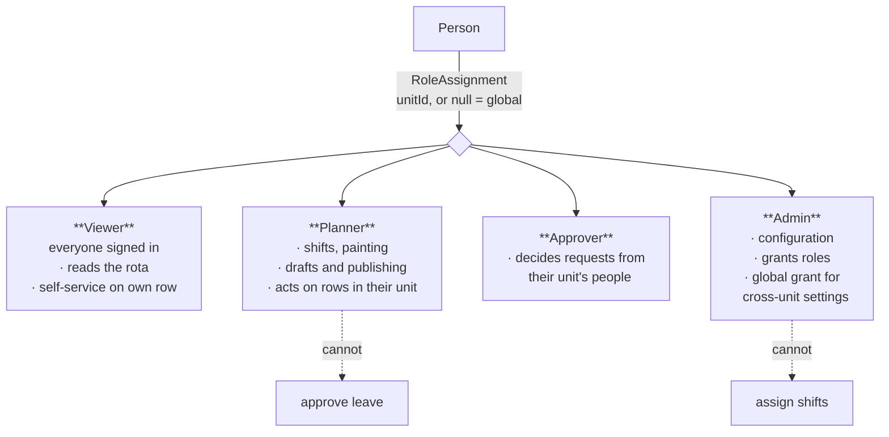
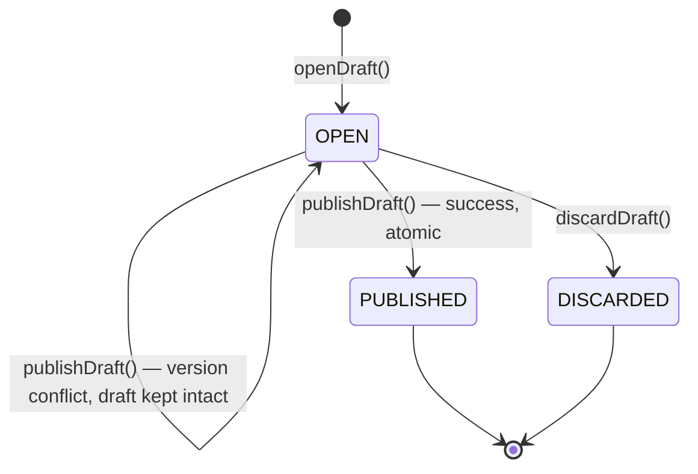
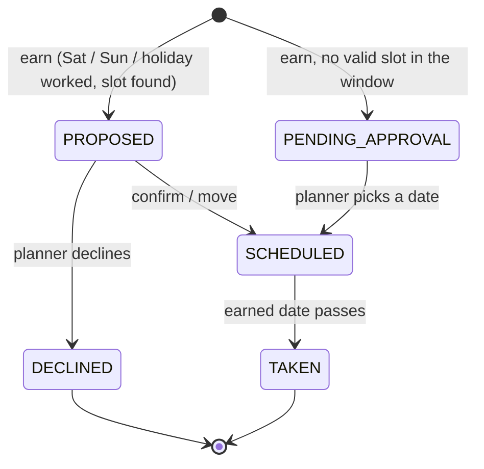

# Domain model

## Single axis: PlanningUnit

The single most important structural decision ([ADR-0032](adr/0032-planning-unit-single-rule-axis.md)): **a planning unit is the sole rule boundary** — which rules apply, whose screen a person appears on, everything.

- **PlanningUnit** answers *which rules apply* and *whose screen this person appears on* — shifts, day configurations, coverage requirements, comp-off policy.

Units come in two kinds:
- **REGION** units: `unit-amer`, `unit-emea`, `unit-apac` — each is a region's roster.
- **CROSS_REGION** units: `unit-st` (Service Transition) — a team drawn from people who sit in different regions' locations, but plans and is staffed as one unit.

A person belongs to exactly one unit (`Person.unitId`) — there is no dual membership. An ST engineer who happens to sit in Hartford is in **unit-st**, full stop: their shifts, eligibility, and coverage all resolve against `unit-st`'s own day configurations (which carry `min=0` — ST coverage is optional, not required; see [ADR-0034](adr/0034-zero-minimum-legal-coverage-state.md)). Their `Location` (Hartford) still governs their calendar and display timezone, independently of which unit they're on — that's the whole point of `Location` and `PlanningUnit` being two separate axes instead of one.

**Coverage is computed per unit.** Absence limits are per unit. Comp-off policy is per unit.

## Relationship overview

```
PlanningUnit  (single rule boundary: unit-amer | unit-emea | unit-apac | unit-st)
 ├─ references Locations (many-to-many)
 ├─ defines Shifts                what work is done, with its own time window
 ├─ defines DayConfigurations    which shifts apply to which group of days
 │    └─ each holds ShiftRequirements  min / max / default per shift
 ├─ owns CompOffPolicy
 └─ owns AbsenceCapacityRules

Location
 ├─ timezone (display)
 └─ holiday calendar + weekend days      → what is non-working for a person

Person
 ├─ belongs to a PlanningUnit    → rules, shifts, coverage, whose screen
 ├─ has a Location                → calendar and display timezone only (ADR-0002)
 ├─ has a presence baseline       → where they work when nothing says otherwise
 ├─ may have a Manager            → an input to approval routing, not the route (ADR-0046)
 └─ has ShiftEligibility, availability, constraints, preferences

Assignment            one person + one date + one working shift
 ├─ published, or held as a DraftChange
 ├─ contributes to the computed CoverageSnapshot
 └─ may earn a CompDayEntry

EventType             a kind of time off, as a row: what it blocks, whether it counts
                      toward capacity, whether it needs approving (ADR-0049)
PresenceType          a way of working, as a row: whether it names a Location, and
                      what the coverage strip counts it as (ADR-0054)

Absence               one person + an inclusive date range + an EventType + a portion
PresenceRecord        one person + an inclusive date range + a PresenceType + a portion.
                      Orthogonal to Assignment: both are true at once (ADR-0043)
CompDayEntry          an accrual with a balance, linked to the earning assignment
Holiday               a date + name + affected locations

Request               something asked for about one person
 ├─ shaped by a RequestType       → what it is, and what an approval produces
 ├─ decided by the Approvers of the subject's unit (ADR-0051)
 ├─ collects append-only ApprovalDecisions
 └─ on approval, writes an Absence or a PresenceRecord (ADR-0045)

RoleAssignment        one person + one role + one unit (or global): who may do what,
                      and where (ADR-0051)

Notification          one person's inbox item, written in the same transaction
                      as the change that caused it (ADR-0044)
 ├─ fanned out by NotificationRules → the (kind × channel) matrix (ADR-0064)
 └─ collects NotificationDeliveries → one per channel, sent/failed/skipped-with-a-reason

ChangeHistoryEntry    append-only, for every entity — not just assignments (ADR-0040)

DraftSession          one editor + one unit + one period
 └─ ordered DraftChanges → applied atomically on Publish

SystemSetup           one row, fixed key: this system has content, and which preset
                      wrote it (ADR-0059)

CellValue             a projection: what the grid shows for (person, date)
```

## Entity relationships

The ASCII sketch above is the narrative; this is the same model as a diagram, with
cardinalities. PlanningUnit is the sole rule axis — that is ADR-0032, not an accident of layout.



## Two write flows

Everything that changes data goes down one of two paths, and which one is decided by
**what is being written**, never by who is writing it
([ADR-0052](adr/0052-two-flows-drafts-for-shifts-approval-for-everything-else.md)).



The dotted line is the one place they meet: a comp day is **accrued** by publishing a
weekend shift, and **placed** by asking for a day off.

| | Draft + publish | Direct write | Request + approval |
|---|---|---|---|
| Shift assignment | ✓ | | |
| Comp-day accrual | ✓ | | |
| Comp-day placement | | | ✓ |
| Absence, `requiresApproval` | | | ✓ |
| Absence, no approval (`Not available`) | | ✓ | |
| Presence — office, travel, customer site | | ✓ | |
| Presence — remote | | | ✓ |
| Acknowledging a warning | | ✓ | |
| Configuration, role grants | | ✓ | |

**Why not one mechanism.** A draft's value is *review before it becomes real*, by the
person staging the batch. Time off already has a review step, and it is a better one,
because it names the human who decided and records their comment. Putting time off in a
draft meant a sick day stayed invisible until an unrelated planner happened to publish
something — and that recording one called a planner-only endpoint, so a viewer reporting
their own sickness got a 403.

## Roles

Roles are a **set**, granted per planning unit, with no ordering between them
([ADR-0051](adr/0051-roles-are-a-scoped-set.md)). Holding two grants both; holding one
grants only it.



The two dotted lines are the point. Before ADR-0051 the policies compared roles by
ordinal, so `Admin > Planner` made every administrator a planner of every unit — a right
nobody granted and nobody could withhold.

**Scope.** A grant names a unit, or is global (`unitId` null). Global widens *scope*, never
*privilege*: a global Admin is an admin everywhere and still not a planner anywhere. It
exists for configuration that belongs to no unit — locations, holidays, the units
themselves — and for the cross-unit planner who covers for everybody.

**Where the checks live.** Endpoint policies can only ask "holds this role *somewhere*",
because a policy runs before the request body is read and cannot know which unit is being
written to. The decision is the unit-scoped `Capabilities` check in the handler. A policy
alone is never sufficient authorization for a write.

## Draft session lifecycle

Full narrative in [03-drafts-and-publication.md](03-drafts-and-publication.md); this is
the same three states as a diagram. A failed publish leaves the session `OPEN` with the
draft intact — never a fourth "conflicted" state, because the draft itself didn't
change, only the verdict on applying it.



## Planning unit

```
PlanningUnit {
  id, name
  kind                  REGION | CROSS_REGION
  primaryLocationId     whose holiday calendar decides "is this a holiday for the rota"
  locationIds[]         many-to-many — Pune hosts amer/emea/apac at once
  groupBy               LOCATION | REGION | ORG_CATEGORY
  compOffPolicy
}
```

Default units: `unit-amer`, `unit-emea`, `unit-apac` (kind `REGION`, grouped by location) and
`unit-st` (kind `CROSS_REGION`, grouped by location).

**A unit is a default filter, not a hard boundary** when displayed on screen — the Schedule screen defaults to
the selected unit's people and offers a toggle to show all people working that unit's shifts. Because every
planner can write anywhere (see Access below), a gap in a shift belonging to another
unit can be fixed without leaving the screen.

Adding a fourth unit — "Automation", "SRE" — is a data change.

## Location

Responsible for exactly two things: the calendar of weekends and public holidays, and
the timezone used to display a person's schedule to them. Nothing to do with shift
timing.

```
Location {
  id, name
  timeZone              IANA
  holidayCalendarKey    'US' | 'GB' | 'CH' | 'SG' | 'IN'
  weekendDays[]         usually [Sat, Sun]
  country
}
```

Known locations: Singapore, Pune, London, Stevenage, Zurich, Chicago, New York,
Hartford.

## Shift

**One entity, one absolute window** ([ADR-0033](adr/0033-one-shift-entity-absolute-window.md)): a shift created as 11:00–20:00 New York is that same absolute interval for everyone holding it, with no location-specific bending.

```
Shift {
  id, unitId
  code                 'Lead', 'Crew', 'Batch-E', 'E', 'BM', 'M', 'Primary'
  label, description   operational purpose, shown in the picker and settings
  color                configuration, not decoration
  hotkey?              unique within the unit
  timeZone, start, end, crossesMidnight
  breakMinutes
  countsAsCoverage
  editableTime
}
```

Shifts belong to a unit ([ADR-0032](adr/0032-planning-unit-single-rule-axis.md)). `ST:AMER` in unit-st and `ST Amer` in unit-amer are separate entities; matching codes across units are
coincidental.

On-call is an ordinary shift code occupying the day, not a parallel duty — see
"Assignment".

### Real shift codes

| Unit | Codes |
|---|---|
| unit-apac | `M`, `G`, `MC` |
| unit-emea | `E`, `BM`, `BM-Lead`, `Shift-Lead`, `MOD`, `CH-Early`, `CH-SL`, `CH-Late`, `CH-OC`, `CH-OC-Mo`, `CH-OC-Ev`, `CH` |
| unit-amer Mon–Thu | `Lead`, `Crew`, `Crew-BC`, `Batch-E`, `Batch-L`, `Batch-U`, `Cover`, `ST Amer` |
| unit-amer Friday | `Lead-E`, `Crew-E`, `Crew-L`, `Batch-E`, `Batch-L`, `Cover` |
| unit-amer weekend | `Primary`, `Secondary`, `ST`, `Shadow`, `BCM` |
| unit-st | `ST:AMER`, `ST:EMEA`, `ST:APAC` |

**`Cover` is engineering work**, not spare capacity: incident and alert coverage,
automation, improvement work, and **in-hours training**. A person on `Cover` is at
work. This is why training is not an absence.

## Day configuration

**Different day groups carry different shift sets, not just different minimums**
([ADR-0016](adr/0016-day-configuration-groups.md)). AMER Monday–Thursday has `Lead` and
`Crew`; Friday has `Lead-E`, `Crew-E` and `Crew-L` — different shifts, not different
counts.

```
DayConfiguration {
  id, unitId
  key                  'weekday' | 'friday' | 'weekend' | 'holiday' | 'date'
  weekdays[]           for weekday-style groups
  date?, label?        for a one-off group — deferred, see below
  shiftRequirements[]
  effectiveFrom        see "Effective dating"
}

ShiftRequirement {
  shiftId
  min                  hard requirement; below it is a gap. Zero is legal ([ADR-0034](adr/0034-zero-minimum-legal-coverage-state.md))
  max?                 above it is a warning
  isDefault            offered in the picker even without a requirement
  timingOverride?      this shift runs at a different time on this day group
}
```

Resolution for a date, most specific first: `date` → `holiday` → `weekend` → the
weekday group containing that weekday.

> **`date` configurations are deferred.** For a DR test or month-end close the planners
> simply know the event is happening and staff up. Distinct minimums for an event are a
> custom case and are not built now. The variant stays in the type; no UI, no fixtures.
> ([ADR-0008](adr/0008-events-are-dated-coverage-rules.md))

### Real coverage minimums

| Day group | Requirements (`min`/`max`) |
|---|---|
| unit-amer Mon–Thu | Lead 1/1, Crew 1/∞, Batch-E 1/1, Batch-L 1/1, Cover 0/3, Crew-BC 0/1, Batch-U 0/1 |
| unit-amer Friday | Lead-E 1/1, Crew-E 1/3, Crew-L 1/1, Batch-E 1/1, Batch-L 1/1 |
| unit-amer weekend | Primary 1/1, Secondary 0/1, ST 0/1 |
| unit-emea weekday | Shift-Lead or BM-Lead 1/2, BM 1/∞, E 1/∞ |
| unit-apac weekday | M 1/∞ |
| unit-st all | All shifts 0/∞ (zero-minimum, optional coverage) |

## Effective dating

Coverage requirements, shifts and day configurations are **versioned with an effective
date** ([ADR-0021](adr/0021-effective-dated-configuration.md)). Raising a minimum today
must not turn last March red: March was closed against the rule in force in March.

Coverage for a date always resolves the configuration version whose effective range
contains that date. Settings edits create a new version from a chosen effective date;
they never mutate the previous one.

## Person

```
Person {
  id                        stable; history stays attached to it
  displayName, initials
  email?                    the work address an Entra ID sign-in resolves by (ADR-0058);
                            filtered unique index — a credential in all but name
  employeeId?               a unique external key once set; what an HR import will match on
  unitId                    rules, coverage, whose screen
  locationId                calendar and display timezone only (ADR-0002)
  orgCategory               SUPPORT | SERVICE_TRANSITION | MANAGEMENT
  isActive                  deactivation ≠ deletion
  isIncluded                participates in planning at all
  eligibility[]
  availableWeekdays[]
  defaultShiftId?           an exception mechanism, null for nearly everyone (ADR-0038)
  weekendEligible
  constraints  { minRestHours, maxConsecutiveDays, maxWeekendsPerQuarter }
  preferences  { avoidsWeekdays[], preferredPartnerIds[], blackoutDates[] }
  calendarToken             256 bits, [JsonIgnore]; the ICS feed's whole authentication (ADR-0055)
  defaultPresenceTypeId     → PresenceType; the baseline way of working (ADR-0054)
  defaultSiteLocationId?    which office is the baseline
  managerId?                context, not a route: who approves is the `Approver` grant (ADR-0051)
}
```

> **`defaultShiftId` is the exception, not the rule.** The shift that absorbs everyone on
> an ordinary day belongs to the **day configuration** — the requirement marked
> `isDefault` with no `max` ([ADR-0038](adr/0038-day-configuration-owns-the-default-shift.md)).
> `Person.defaultShiftId` survives only for Service Transition, whose engineers hold one
> shift each, and is null for everyone else. Engineers do not have a default shift; they
> have shifts they cannot do.

**There is no separate work-pattern entity**
([ADR-0005](adr/0005-no-work-pattern-entity.md)). `defaultShiftId` and
`availableWeekdays` are person fields consumed only by auto-populate; they never
override an explicit assignment.

`orgCategory` is a reporting and grouping attribute. Managers are
`orgCategory = MANAGEMENT` with `isIncluded = false`, which keeps them in the roster
and out of the planning rows.

```
ShiftEligibility {
  shiftId
  targetShare          desired share of this person's workload, 0..1
  minPerWeek?, maxPerWeek?
}
```

Eligibility stores a **target share, not a boolean**
([ADR-0006](adr/0006-eligibility-target-shares.md)). A shift absent from the list means
"not eligible"; the boolean case is a degenerate instance.

## Assignment

One person, one date, one working shift.

```
Assignment {
  id
  personId, date            date is local to the shift's timezone
  unitId                    denormalized from the person's unit
  content                   { kind: 'SHIFT', shiftId, timeOverride? }
  isWeekend                 by the person's location calendar
  note?
  source                    MANUAL | GENERATED | IMPORTED
  version                   optimistic concurrency token
  createdBy, createdAt, updatedBy, updatedAt
}
```

**Exactly one assignment per (person, date).** A person is never on two duties the same
day — including on-call, which is an ordinary shift code occupying the day like any
other. This is a hard uniqueness constraint, not a soft rule.

**An assignment is a shift.** It used to be a union with a marker arm carrying `OFF`
(the spreadsheet's `Off` / `W-Off`) and `NOT_SCHEDULED` (`0`), on the reasoning that
"considered and deliberately not scheduled" differs from "nobody has looked at this yet".
The team did not use the distinction, nothing forced a planner to record it, and what
people actually wanted — "do not put me on a shift that weekend" — is now the
`UNAVAILABLE` event type, which every screen that understands absences already
understands ([ADR-0052](adr/0052-two-flows-drafts-for-shifts-approval-for-everything-else.md)).

An empty cell means **no shift**. Nothing more.

## Event type

**A kind of time off is a row, not an enum arm**
([ADR-0049](adr/0049-event-types-are-data.md)). Adding "floating holiday" is data, and an
admin adding one on Settings → Leave types cannot change what coverage counts, because
anything that counts as coverage is a `Shift`.

```
EventType {
  id, code
  label, shortLabel, color
  category              LEAVE | SICKNESS | OTHER      display grouping only
  blocksAssignment      may a shift sit on the same day
  countsTowardCapacity  does it consume an absence-capacity slot
  requiresApproval      refused on /api/absences; must go through a request
  allowsHalfDay         may it carry a MORNING / AFTERNOON portion
  isActive, sortOrder
}
```

There is deliberately **no `countsAsCoverage`**: that is what makes `CoverageCalculator`
untouched by an admin adding a leave type. Sickness *requires* approval
([ADR-0052](adr/0052-two-flows-drafts-for-shifts-approval-for-everything-else.md),
reversing ADR-0049) and still does not count against capacity. The only seeded type needing
no approval is `UNAVAILABLE` — a declaration of availability, not a request for time.

## Absence

Leave is a **range**, and the range is the source of truth
([ADR-0017](adr/0017-absence-range-cell-projection.md)): it arrives from the corporate
system as a range, and simultaneous-absence limits are computed over ranges.

```
Absence {
  id, personId
  eventTypeId           → EventType; the behaviour is that row's columns
  portion               FULL | MORNING | AFTERNOON    (ADR-0050)
  from, to              inclusive
  source                IMPORT | MANUAL
  importBatchId?, lastSeenInImportAt?
  syncedToHrAt?
  note?
  version               int, round-tripped untouched (ADR-0042)
}
```

**Training is not an absence.** In-hours training and other engineering activity is the
`Cover` shift — the person is at work. A `Training` value in a historical spreadsheet
maps to `Cover`, not to leave, and therefore counts toward coverage.

**One day, one record.** A direct write or an approved request **supersedes** what already
covered those days, trimming the old range rather than deleting it, so the days it did not
lose survive. `RangeSupersede` holds the arithmetic: a whole day beats anything, the same
half beats itself, and a half never trims a whole day — that would discard the other half.
Changing the kind of leave is a new request, not an edit
([ADR-0052](adr/0052-two-flows-drafts-for-shifts-approval-for-everything-else.md)).

`lastSeenInImportAt` detects records that vanished from a later export. Import never
overwrites a `MANUAL` record.

## Presence type

**A way of working is a row, and the set is open**
([ADR-0054](adr/0054-presence-types-are-an-open-set.md), reopening ADR-0053). `PresenceKind`
is deleted; the two things code used to branch on are columns.

```
PresenceType {
  id, label, glyph, color
  namesALocation    true → siteLocationId points at a Location; false → free-text siteLabel
  countsAs          ON_SITE | REMOTE | AWAY    the coverage strip's headcount — a CLOSED set
  requiresApproval  enforced by the server (APPROVAL_REQUIRED), not by the cell menu
  isActive, sortOrder
}
```

`countsAs` stays closed on purpose: a strip row cannot grow a column per type an admin
invents. Full CRUD lives on Settings → Presence, and **DELETE is refused once anything
points at the type** — the answer is to untick Offered. A type that needs approving **owns a
request type**, created and retired with it; otherwise ticking the box makes a menu item
with nowhere to send the request. `engine/presence.ts` draws `?` for a type it does not
hold, because a blank glyph reads as "nothing recorded".

## Presence

Where a person physically works. **Orthogonal to whether they work at all** — someone on
the `Crew` shift is *also* either remote or in an office, and both facts are true at once
([ADR-0043](adr/0043-presence-is-an-orthogonal-range-entity.md)).

```
PresenceRecord {
  id, personId
  typeId            → PresenceType (ADR-0054); the kind enum is deleted
  siteLocationId?   which office, when the type namesALocation
  siteLabel?        free text for a type that does not, e.g. travel or a customer site
  portion           FULL | MORNING | AFTERNOON   (ADR-0050)
  from, to          inclusive, same shape as Absence
  source            MANUAL | REQUEST | IMPORT | PORTAL
  requestId?        set when it came from an approved request
  externalId?, lastSeenInSyncAt?
  note?, version
  createdBy, createdAt, updatedBy, updatedAt
}
```

Three things this is deliberately **not**:

- **Not a field on `Assignment`.** Presence exists on days with no assignment, it is
  owned by a different person than the roster is, and it is declared in blocks rather
  than cell by cell.
- **Not a member of `CellValue`.** That union resolves a precedence chain and produces one
  winner; presence has no precedence relationship with anything in it. It is a second,
  independent projection over the same cell keys (`engine/presence.ts`). If a change to
  presence makes you want to edit `cellValue.ts`, the change is wrong.
- **Not an input to coverage.** A remote person on `Crew` covers `Crew`. If on-site
  staffing ever becomes a requirement it belongs on `ShiftRequirement`, which is already
  effective-dated.

`Person.defaultPresenceTypeId` / `defaultSiteLocationId` are the **baseline**. The grid
draws **every** recorded day, coloured by type and quieter when it matches the baseline —
ADR-0043's "draw only a departure" rule was reversed by
[ADR-0050](adr/0050-one-grid-half-days-and-the-split-cell.md), because records are sparse
and drawing only departures hid the only ones there were.

Reusing `Location` as a *place* does not widen [ADR-0002](adr/0002-location-is-calendar-only.md):
Pune-the-holiday-calendar and Pune-the-office are the same real thing, and the calendar
responsibility is unchanged.

## Requests and approvals

Something a person asks for about themselves, routed to approvers, and — once approved —
written into the plan ([ADR-0045](adr/0045-generic-request-envelope-typed-materialization.md)).

```
RequestType {                     configuration, admin-editable
  id, code, label
  category        PRESENCE | LEAVE | SWAP | COMP_DAY | OTHER
  materializer    NONE | PRESENCE | ABSENCE
  presenceKind? / absenceType?    what an approval produces
  routeId, isActive, sortOrder
}

Request {
  id, typeId, subjectPersonId, unitId
  from, to                        columns, not payload — the inbox and the capacity
                                  check both read them
  payloadJson?                    type-specific detail
  note?, state
  failureReason?, materializedEntityId?
  createdBy, createdAt, updatedAt?, decidedAt?, version
}

RoleAssignment {                  who may do what, and where (ADR-0051)
  id, personId
  unitId?                         null = global: every unit, and the configuration
                                  that belongs to none
  role      VIEWER | PLANNER | APPROVER | ADMIN
  grantedBy, grantedAt            the grant is itself an auditable act
}

ApprovalDecision {                append-only, one row per human act
  id, requestId
  decision  APPROVE | REJECT | RETURN
  byPersonId, comment?, at
}
```

The envelope is generic so that adding a request type is a row rather than a deployment;
the **outcome** is typed, because the coverage, validation and cell-projection engines all
read typed rows and would be blind to a JSON blob.

```mermaid
stateDiagram-v2
    [*] --> SUBMITTED: raise
    SUBMITTED --> DRAFT: returned to the requester
    DRAFT --> SUBMITTED: resubmit
    SUBMITTED --> REJECTED: declined
    SUBMITTED --> APPROVED: approved at the last step
    APPROVED --> APPLIED: the Absence or PresenceRecord is written
    APPROVED --> APPLY_FAILED: the write could not be made
    APPLY_FAILED --> APPLIED: retry
    SUBMITTED --> CANCELLED: withdrawn
    APPLIED --> CANCELLED: withdrawn; what it created is removed
    REJECTED --> [*]
    CANCELLED --> [*]
    APPLIED --> [*]
```



**`APPROVED` and `APPLIED` are separate on purpose.** Approval is a decision a human made;
application is a write that can fail. Collapsing them would silently un-approve a human
decision on a technical fault, and neither the requester nor the approver would learn that
nothing happened.

**Routing is not authorization** ([ADR-0046](adr/0046-routing-is-not-authorization.md)).
A route decides whose *inbox* a request lands in; the policy decides who *may* act. A step
that resolves to nobody is skipped rather than stalling the request, and only when no step
resolves does `fallbackPersonId` apply.

## Notification

One person's inbox item, written **inside the same transaction** as the change that caused
it ([ADR-0044](adr/0044-in-app-inbox-first.md)) — so it cannot be lost to a crash between
the state change and the send, because there is no send.

```
Notification {
  id, recipientPersonId
  kind          REQUEST_SUBMITTED | REQUEST_APPROVED | REQUEST_REJECTED
              | REQUEST_APPLY_FAILED | REQUEST_SUPERSEDED
              | COMP_DAY_AGING | COVERAGE_GAP
  title, body?
  subjectType?, subjectId?              for deep links
  createdAt, readAt?                    readAt is the recipient's own state
  deliveries[]                          one per channel it is owed on
}
```

### The matrix and the log

What leaves the product is a **matrix**, and what happened to it is a **log**
([ADR-0064](adr/0064-a-notification-policy-and-a-log.md)). Both axes are code — a channel
is a sender somebody has to write, and a kind is emitted from somewhere — so what is data
is the cell where they cross.

```
NotificationRule {                       one per (kind, channel), fixed id
  kind, channel     EMAIL | TEAMS        IN_APP is not a cell: the inbox row is the inbox
  enabled                                topped up at startup, off
  userOverridable                        may a person opt out (not yet honoured)
}

NotificationDelivery {                   child of Notification, one per channel
  id, notificationId, channel
  status        PENDING | SENT | FAILED | SKIPPED
  skipReason?   CHANNEL_DISABLED | NO_ADDRESS | USER_OPTED_OUT
  attempts, lastError?, sentAt?, createdAt
}
```

Two properties are load-bearing:

- **The fan-out happens when the notification is written**, in the same transaction, so a
  delivery row records the policy in force at that moment. Editing the matrix does not
  rewrite what is already queued.
- **A skipped delivery is a row, never an absence.** Without it, "no row" would mean both
  "not owed one" and "lost one", and the administrator's log could not tell them apart —
  which is the one question it exists to answer.

Nothing is delivered externally yet: an enabled cell writes `PENDING` rows that accumulate
until the dispatcher lands. See [13-roadmap.md](13-roadmap.md).

## Comp day

An **accrual with a balance**, not a calendar event
([ADR-0007](adr/0007-comp-day-as-balance.md)). **Comp days do not expire.** Full
mechanics in [05-comp-days.md](05-comp-days.md).

```
CompOffPolicy {
  windowBeforeDays, windowAfterDays      search window around the earned date
  excludedWeekdays[]                     default: Monday, Friday
  agingThresholdDays                     configurable; past it, the entry is flagged
  requiresApprovalWhenNoSlot             true
}

CompDayEntry {
  id, personId
  earnedForAssignmentId, earnedForDate
  proposedDate                           nearest free eligible date in the window
  actualDate?                            after the planner moves it
  status    PROPOSED | SCHEDULED | TAKEN | DECLINED | PENDING_APPROVAL
  syncedToHrAt?
}
```

Saturday and Sunday are two independent earning events and may produce two entries.

Full mechanics, including the window search, live in
[05-comp-days.md](05-comp-days.md); this is the same status machine as a diagram. No
terminal expiry state — `TAKEN` and `DECLINED` are the only ends, and an entry with no
valid slot in its window goes to `PENDING_APPROVAL` rather than being dropped.



## Holiday

```
Holiday { id, date, name, locationIds[], isFullDay }
```

A holiday says nothing about who works. One person may show `PH` while another holds a
shift on the same date. Holiday definition and holiday coverage stay separate.

## Cell value — the projection

The grid renders one value per (person, date), derived from the entities above. This
projection is the single place where precedence lives.

```
CellValue =
  | { kind: 'SHIFT',  shift, assignment, event?, conflict? }
  | { kind: 'STATUS', status: 'PH' | 'COMP_OFF' | 'ABSENT', event? }
  | { kind: 'EMPTY' }                            no shift
```

`ABSENT` carries the kind of absence in `event` rather than enumerating it in the status
([ADR-0049](adr/0049-event-types-are-data.md)), so an admin adding a leave type does not
widen a union.

Precedence, first match wins:

1. an `Assignment` — a person can be scheduled on a holiday or a weekend, and that must
   win over any non-working signal;
2. an `Absence` covering the date;
3. a `CompDayEntry` that is `SCHEDULED` or `TAKEN` on the date;
4. a `Holiday` affecting the person's location → `PH`;
5. otherwise `EMPTY`.

When rule 1 fires and rule 2, 3 or 4 would also have fired, the cell additionally
carries a **conflict** — see
[04-coverage-and-validation.md](04-coverage-and-validation.md). A `PROPOSED` comp day is
drawn as a dashed hint over an empty cell; it does not yet occupy the day.

## Coverage snapshot

Computed, never stored by hand. For one unit and date: filled count per shift, gaps,
conflicts, headcount, total required, total filled. Recomputed after every draft change
and authoritatively rechecked on publish.

**Coverage is computed per unit.** A gap in `ST:AMER` appears
in the unit-st coverage strip — the requirement belongs to the unit, and anyone may fix it.

## Draft session

```
DraftSession {
  id, editorPersonId, unitId
  from, to                       the period being edited
  status                         OPEN | PUBLISHED | DISCARDED
  createdAt, updatedAt
}

DraftChange {
  id, sessionId, seq
  op                             CREATE | UPDATE | DELETE
  targetType                     ASSIGNMENT | ABSENCE | COMP_DAY
  targetId?
  before, after                  full values, so the change is reversible
  at
}
```

One open session per (editor, unit) with an overlapping period. Different planners may
hold overlapping drafts; the conflict is resolved on publish, not prevented up front
([ADR-0015](adr/0015-optimistic-drafts-and-publication.md)). Lifecycle in
[03-drafts-and-publication.md](03-drafts-and-publication.md).

## Absence capacity rule

A limit on simultaneous absences, checked when leave is approved rather than when
shifts are planned. **The shift-pool limit matters more than the overall one**
([ADR-0010](adr/0010-absence-limits-by-role-pool.md)): three of the four people who can
lead being out at once is a problem a headcount counter never sees.

```
AbsenceCapacityRule {
  id, unitId
  scope                 UNIT | SHIFT_POOL(shiftId)
  durationBucket        SHORT | LONG
  longThresholdWorkdays 5
  maxConcurrent
  countsTypes[]
}
```

Confirmed defaults: at most **3 long** and **4 short** absences per unit. Shift-pool
limits are configurable; the critical lead-type pools are seeded at 1 as an
`ASSUMPTION`.

## Handover

Not a stored entity. A handover between units is the intersection of two units'
shift windows on the timeline, computed on the fly by `engine/timeline.ts`
(`Handover { fromUnitId, toUnitId, ... }`, a view-layer type, not a domain entity).
Storing it separately would let it drift from reality on the first DST transition —
the two units' actual windows are the source of truth, not a cached overlap.

## Access and audit

```
ChangeHistoryEntry {
  id
  entityType   ASSIGNMENT | ABSENCE | COMP_DAY | PRESENCE | PERSON | CONFIGURATION
  entityId
  action       CREATED | UPDATED | DELETED
  snapshotJson?    state after the action; null on delete
  personId?        who the record is about, when there is one
  summary?         prose, for entities whose snapshot is not worth rendering
  actorId, at
}                                                                   append-only

Acknowledgement   { issueKey, comment, byPersonId, at }
```

```
RoleAssignment { id, personId, unitId?, role }      unitId null = global
SystemSetup    { id = 1, preset, completedByPersonId?, completedAt }
```

Who may do what is the scoped role set described under [Roles](#roles)
([ADR-0051](adr/0051-roles-are-a-scoped-set.md)) — not a hierarchy, and not a claim in the
token: grants live in the database, because planning units are ours and no IdP knows them.
Entra ID app roles can map to **global** grants that add to the per-unit ones, but they are
**off by default** behind `Auth:DirectoryRoles`
([ADR-0062](adr/0062-one-source-of-roles-by-default.md)): the database is the single source,
so Settings → Roles tells the whole truth. A directory grant can only ever be global and
only ever additive, which is why the switch is a boolean and not a choice of three.

`SystemSetup` is one row with a fixed primary key, and its **presence** is the whole of
"this system has content" ([ADR-0059](adr/0059-setup-is-a-screen-not-a-flag.md)). It is not
an inferred condition like "no planning units exist", which a half-written database would
satisfy and reopen the wizard on top of itself.

ADR-0032 argued that write access needs no unit scoping because the control is
**a complete audit trail**, not a permission matrix: every change records who made it,
when, and what the previous value was. Two things had to become true before that argument
actually held:

- **The actor is the authenticated principal, never a request field**
  ([ADR-0039](adr/0039-actor-identity-from-the-token.md)). A body-supplied actor id made
  the trail forgeable by exactly the people it was meant to constrain.
- **The trail covers every entity, not just assignments**
  ([ADR-0040](adr/0040-one-change-history-for-every-entity.md)). Leave, comp days,
  presence, profile edits and configuration changes previously left no record at all —
  and two of those decide tomorrow's roster. A new write path with no history row is a bug.

The trail remains load-bearing; what changed is that it stopped being the *only* control.
Approval is a decision made before the fact, and "whose leave may I sign off" is not a
question an audit trail answers afterwards — hence the per-unit grant
([ADR-0051](adr/0051-roles-are-a-scoped-set.md)).

Self-service adds one more kind of denial, and it is not unit scoping returning by another
door: **another person's own record**. "Can I edit my own presence" is a per-resource
question that ADR-0032 never addressed, because self-service did not exist
([ADR-0046](adr/0046-routing-is-not-authorization.md)).

A batch of person edits saves as **one unit of work** — ops that release a unique value
(`Email`, `EmployeeId`) applied first, everything in one transaction, all-or-nothing, and a
history row per person ([ADR-0061](adr/0061-settings-saves-people-as-one-unit.md)).

**Where the trail is still incomplete.** Person edits write history since ADR-0061;
locations, units, shifts, day configurations, holidays and absence capacity rules do
**not** — those admin endpoints write no `ChangeHistoryEntry` at all, which is a live gap
against ADR-0040 rather than a decision.
