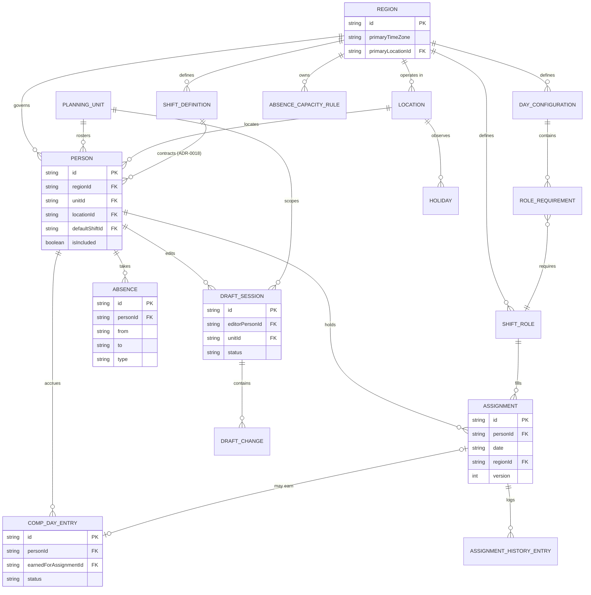
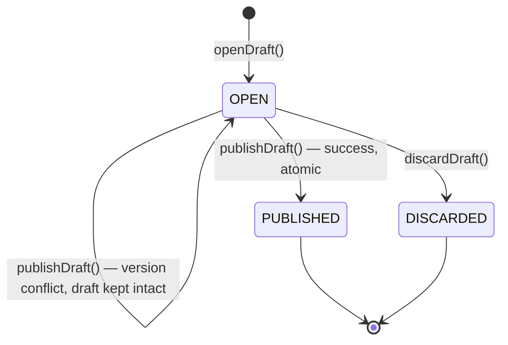
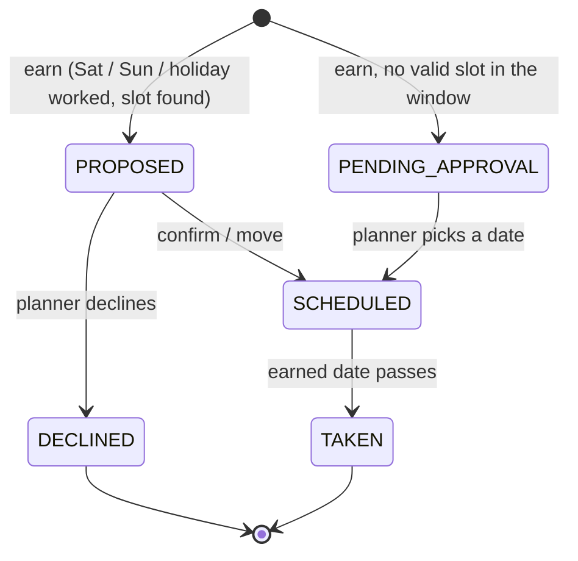

# Domain model

## Two orthogonal axes

The single most important structural decision
([ADR-0020](adr/0020-planning-unit-and-region.md)): **a region and a planning unit are
different things and a person belongs to both.**

- **Region** answers *which rules apply* — roles, day configurations, coverage
  requirements, comp-off policy, handovers.
- **Planning unit** answers *whose screen this person appears on* — a unit is either a
  region's own roster or a cross-region team such as Service Transition.

An ST engineer in Hartford is in the **AMER region** (works AMER hours, holds the
`ST Amer` role, counts toward AMER coverage) and in the **Service Transition planning
unit** (planned by the manager who plans ST across all regions).

## Relationship overview

```
Region  (rule boundary: AMER | EMEA | APAC)
 ├─ references Locations
 ├─ defines ShiftDefinitions          contracted working windows
 ├─ defines ShiftRoles                what work is done, with its own time window
 ├─ defines DayConfigurations         which roles apply to which group of days
 │    └─ each holds RoleRequirements  min / max / default per role
 ├─ owns CompOffPolicy
 ├─ owns AbsenceCapacityRules
 └─ participates in Handovers

PlanningUnit  (planning boundary)
 ├─ kind: REGION → one region's roster
 │      | CROSS_REGION → a team drawn from several regions
 └─ groupBy: LOCATION | REGION | ORG_CATEGORY

Location
 ├─ timezone (display)
 └─ holiday calendar + weekend days      → what is non-working for a person

Person
 ├─ belongs to a Region       → rules, roles, coverage
 ├─ belongs to a PlanningUnit → whose screen
 ├─ has a Location and a default ShiftDefinition
 └─ has RoleEligibility, availability, constraints, preferences

Assignment            one person + one date + (working role | roster marker)
 ├─ published, or held as a DraftChange
 ├─ contributes to the computed CoverageSnapshot
 ├─ may earn a CompDayEntry
 └─ has append-only AssignmentHistory

Absence               one person + an inclusive date range + a leave type
CompDayEntry          an accrual with a balance, linked to the earning assignment
Holiday               a date + name + affected locations

DraftSession          one editor + one unit + one period
 └─ ordered DraftChanges → applied atomically on Publish

CellValue             a projection: what the grid shows for (person, date)
```

## Entity relationships

The ASCII sketch above is the narrative; this is the same model as a diagram, with
cardinalities. Region and PlanningUnit are drawn as two independent parents of Person —
that split *is* ADR-0020, not an accident of layout.



## Draft session lifecycle

Full narrative in [03-drafts-and-publication.md](03-drafts-and-publication.md); this is
the same three states as a diagram. A failed publish leaves the session `OPEN` with the
draft intact — never a fourth "conflicted" state, because the draft itself didn't
change, only the verdict on applying it.



## Region

```
Region {
  id                    'AMER' | 'EMEA' | 'APAC'
  name
  primaryTimeZone       classifies a date into a day configuration
  primaryLocationId     whose holiday calendar decides "is this a holiday for the rota"
  locationIds[]
  compOffPolicy
}
```

The region's primary location decides whether a date is a weekday, a weekend or a
holiday **for requirement purposes**. Whether a day is non-working **for a person** is
always their own location's calendar
([ADR-0002](adr/0002-location-is-calendar-only.md)). These two can disagree by a day,
and that is correct.

## Planning unit

```
PlanningUnit {
  id, name
  kind                  REGION | CROSS_REGION
  regionId?             set when kind = REGION
  plannerPersonIds[]    informational; not a permission boundary
  groupBy               LOCATION | REGION | ORG_CATEGORY
}
```

Default units: `AMER`, `EMEA`, `APAC` (kind `REGION`, grouped by location) and
`Service Transition` (kind `CROSS_REGION`, grouped by region).

**A unit is a default filter, not a hard boundary.** The Schedule screen defaults to
the selected unit's people and offers a toggle to show the whole region. Because every
planner can write everywhere (see Access below), a gap in a role belonging to another
unit can be fixed without leaving the screen.

Adding a fourth unit — "Automation", "SRE" — is a data change.

## Location

Responsible for exactly two things: the calendar of weekends and public holidays, and
the timezone used to display a person's schedule to them. Nothing to do with role
timing.

```
Location {
  id, name
  timeZone              IANA
  holidayCalendarKey    'US' | 'GB' | 'CH' | 'SG' | 'IN'
  weekendDays[]         usually [Sat, Sun]
}
```

Known locations: Singapore, Pune, London, Stevenage, Zurich, Chicago, New York,
Hartford.

## Shift definition

A **contracted working window** — an attribute of a person, not of the work they do
that day ([ADR-0018](adr/0018-shift-distinct-from-role.md)).

```
ShiftDefinition {
  id, regionId
  code, name           'APAC', 'EMEA', 'Amer', 'Singapore', 'APAC Mid'
  timeZone             the zone the window is written in
  start, end           local wall-clock
  breakMinutes         60 for the AMER weekday pattern
  netHours             computed
}
```

Examples: Pune APAC shift 06:30–15:00 IST; Pune EMEA shift 13:00–21:30 IST; Singapore
07:00–15:30 SGT; Chicago 09:00–17:30 CT; New York 11:00–19:30 ET.

A shift says when a person is normally at work. A role says what they are doing and
when that duty runs.

## Shift role

**A role carries its own time** ([ADR-0001](adr/0001-role-carries-time.md)), defined in
a fixed timezone. `Crew` is 09:00–18:00 `America/Chicago`, which renders as 10:00–19:00
in New York — one absolute window, two displays.

```
ShiftRole {
  id, regionId
  code                 'Lead', 'Crew', 'Batch-E', 'E', 'BM', 'M', 'Primary'
  label, description   operational purpose, shown in the picker and settings
  color                configuration, not decoration
  hotkey?              unique within the region
  timeZone, start, end, crossesMidnight
  breakMinutes
  countsAsCoverage
  editableTime
}
```

Roles belong to a region ([ADR-0004](adr/0004-roles-belong-to-unit.md)). `Batch-E` in
AMER and `E` in EMEA are unrelated entities; matching codes across regions are
coincidental.

On-call is an ordinary role code occupying the day, not a parallel duty — see
"Assignment".

### Real role codes

| Region | Codes |
|---|---|
| APAC | `M`, `G`, `MC` |
| EMEA | `E`, `BM`, `BM-Lead`, `Shift-Lead`, `MOD`, `CH-Early`, `CH-SL`, `CH-Late`, `CH-OC`, `CH-OC-Mo`, `CH-OC-Ev`, `CH` |
| AMER Mon–Thu | `Lead`, `Crew`, `Crew-BC`, `Batch-E`, `Batch-L`, `Batch-U`, `Cover`, `ST Amer` |
| AMER Friday | `Lead-E`, `Crew-E`, `Crew-L`, `Batch-E`, `Batch-L`, `Cover` |
| AMER weekend | `Primary`, `Secondary`, `ST`, `Shadow`, `BCM` |
| Cross-region | `OnCall S2`, `OnCall S3` |

**`Cover` is engineering work**, not spare capacity: incident and alert coverage,
automation, improvement work, and **in-hours training**. A person on `Cover` is at
work. This is why training is not an absence.

## Day configuration

**Different day groups carry different role sets, not just different minimums**
([ADR-0016](adr/0016-day-configuration-groups.md)). AMER Monday–Thursday has `Lead` and
`Crew`; Friday has `Lead-E`, `Crew-E` and `Crew-L` — different roles, not different
counts.

```
DayConfiguration {
  id, regionId
  key                  'weekday' | 'friday' | 'weekend' | 'holiday' | 'date'
  weekdays[]           for weekday-style groups
  date?, label?        for a one-off group — deferred, see below
  roleRequirements[]
  effectiveFrom        see "Effective dating"
}

RoleRequirement {
  roleId
  min                  hard requirement; below it is a gap
  max?                 above it is a warning
  isDefault            offered in the picker even without a requirement
  timingOverride?      this role runs at a different time on this day group
}
```

Resolution for a date, most specific first: `date` → `holiday` → `weekend` → the
weekday group containing that weekday.

> **`date` configurations are deferred.** For a DR test or month-end close the planners
> simply know the event is happening and staff up. Distinct minimums for an event are a
> custom case and are not built now. The variant stays in the type; no UI, no fixtures.
> ([ADR-0008](adr/0008-events-are-dated-coverage-rules.md))

### Real coverage minimums

| Day group | Requirements (`min`/`max`) |
|---|---|
| AMER Mon–Thu | Lead 1/1, Crew 1/∞, Batch-E 1/1, Batch-L 1/1, Cover 0/3, Crew-BC 0/1, Batch-U 0/1 |
| AMER Friday | Lead-E 1/1, Crew-E 1/3, Crew-L 1/1, Batch-E 1/1, Batch-L 1/1 |
| AMER weekend | Primary 1/1, Secondary 0/1, ST 0/1 |
| EMEA weekday | Shift-Lead or BM-Lead 1/2, BM 1/∞, E 1/∞ |
| APAC weekday | M 1/∞ |

## Effective dating

Coverage requirements, roles and day configurations are **versioned with an effective
date** ([ADR-0021](adr/0021-effective-dated-configuration.md)). Raising a minimum today
must not turn last March red: March was closed against the rule in force in March.

Coverage for a date always resolves the configuration version whose effective range
contains that date. Settings edits create a new version from a chosen effective date;
they never mutate the previous one.

## Person

```
Person {
  id                        stable; history stays attached to it
  displayName, initials, employeeId?
  regionId                  rules and coverage
  planningUnitId            whose screen
  locationId, defaultShiftId
  orgCategory               SUPPORT | SERVICE_TRANSITION | MANAGEMENT
  isActive                  deactivation ≠ deletion
  isIncluded                participates in planning at all
  eligibility[]
  availableWeekdays[]
  defaultRoleId?            the ordinary-day default used by auto-populate
  weekendEligible
  constraints  { minRestHours, maxConsecutiveDays, maxWeekendsPerQuarter }
  preferences  { avoidsWeekdays[], preferredPartnerIds[], blackoutDates[] }
  calendarToken
}
```

**There is no separate work-pattern entity**
([ADR-0005](adr/0005-no-work-pattern-entity.md)). `defaultRoleId` and
`availableWeekdays` are person fields consumed only by auto-populate; they never
override an explicit assignment.

`orgCategory` is a reporting and grouping attribute. It is no longer how Service
Transition is modeled — that is `planningUnitId`. Managers are
`orgCategory = MANAGEMENT` with `isIncluded = false`, which keeps them in the roster
and out of the planning rows.

```
RoleEligibility {
  roleId
  targetShare          desired share of this person's workload, 0..1
  minPerWeek?, maxPerWeek?
}
```

Eligibility stores a **target share, not a boolean**
([ADR-0006](adr/0006-eligibility-target-shares.md)). A role absent from the list means
"not eligible"; the boolean case is a degenerate instance.

## Assignment

One person, one date, and either a working role or a roster marker.

```
Assignment {
  id
  personId, date            date is local to the role's timezone
  regionId
  content                   { kind: 'ROLE',   roleId, timeOverride? }
                          | { kind: 'MARKER', marker: 'OFF' | 'NOT_SCHEDULED' }
  isWeekend                 by the person's location calendar
  note?
  source                    MANUAL | GENERATED | IMPORTED
  version                   optimistic concurrency token
  createdBy, createdAt, updatedBy, updatedAt
}
```

**Exactly one assignment per (person, date).** A person is never on two duties the same
day — including on-call, which is an ordinary role code occupying the day like any
other. This is a hard uniqueness constraint, not a soft rule.

`OFF` is the spreadsheet's `Off` / `W-Off`: a planned day off. `NOT_SCHEDULED` is `0`:
an explicit "no duty", used for weekends in the monthly matrices. Neither is leave, and
both differ from an empty cell, which means **no decision recorded**.

## Absence

Leave is a **range**, and the range is the source of truth
([ADR-0017](adr/0017-absence-range-cell-projection.md)): it arrives from the corporate
system as a range, and simultaneous-absence limits are computed over ranges.

```
Absence {
  id, personId
  type                  VACATION | SICK | OTHER
  from, to              inclusive
  source                IMPORT | MANUAL
  importBatchId?, lastSeenInImportAt?
  syncedToHrAt?
  note?
}
```

**Training is not an absence.** In-hours training and other engineering activity is the
`Cover` role — the person is at work. A `Training` value in a historical spreadsheet
maps to `Cover`, not to leave, and therefore counts toward coverage.

`lastSeenInImportAt` detects records that vanished from a later export. Import never
overwrites a `MANUAL` record.

## Comp day

An **accrual with a balance**, not a calendar event
([ADR-0007](adr/0007-comp-day-as-balance.md)). **Comp days do not expire.** Full
mechanics in [05-comp-days.md](05-comp-days.md).

```
CompOffPolicy {
  windowBeforeDays, windowAfterDays      search window around the earned date
  excludedWeekdays[]                     default: Monday, Friday
  agingThresholdDays                     configurable; past it, the entry is flagged
  requiresApprovalWhenNoSlot             true
}

CompDayEntry {
  id, personId
  earnedForAssignmentId, earnedForDate
  proposedDate                           nearest free eligible date in the window
  actualDate?                            after the planner moves it
  status    PROPOSED | SCHEDULED | TAKEN | DECLINED | PENDING_APPROVAL
  syncedToHrAt?
}
```

Saturday and Sunday are two independent earning events and may produce two entries.

Full mechanics, including the window search, live in
[05-comp-days.md](05-comp-days.md); this is the same status machine as a diagram. No
terminal expiry state — `TAKEN` and `DECLINED` are the only ends, and an entry with no
valid slot in its window goes to `PENDING_APPROVAL` rather than being dropped.



## Holiday

```
Holiday { id, date, name, locationIds[], isFullDay }
```

A holiday says nothing about who works. One person may show `PH` while another holds an
AMER role on the same date. Holiday definition and holiday coverage stay separate.

## Cell value — the projection

The grid renders one value per (person, date), derived from the entities above. This
projection is the single place where precedence lives.

```
CellValue =
  | { kind: 'ROLE',   role, assignment }
  | { kind: 'STATUS', status: 'OFF' | 'NOT_SCHEDULED' | 'PH'
                            | 'COMP_OFF' | 'VACATION' | 'SICK' | 'OTHER' }
  | { kind: 'EMPTY' }                            no decision recorded
```

Precedence, first match wins:

1. an `Assignment` with a working role — a person can be scheduled on a holiday or a
   weekend, and that must win over any non-working signal;
2. an `Absence` covering the date;
3. a `CompDayEntry` that is `SCHEDULED` or `TAKEN` on the date;
4. a `Holiday` affecting the person's location → `PH`;
5. an `Assignment` with a marker → `OFF` / `NOT_SCHEDULED`;
6. otherwise `EMPTY`.

When rule 1 fires and rule 2, 3 or 4 would also have fired, the cell additionally
carries a **conflict** — see
[04-coverage-and-validation.md](04-coverage-and-validation.md). A `PROPOSED` comp day is
drawn as a dashed hint over an empty cell; it does not yet occupy the day.

## Coverage snapshot

Computed, never stored by hand. For one region and date: filled count per role, gaps,
conflicts, headcount, total required, total filled. Recomputed after every draft change
and authoritatively rechecked on publish.

**Coverage is computed per region, not per planning unit.** A gap in `ST Amer` appears
on the AMER coverage strip even though those people are planned in the Service
Transition unit — the requirement belongs to the region, and anyone may fix it.

## Draft session

```
DraftSession {
  id, editorPersonId, planningUnitId
  from, to                       the period being edited
  status                         OPEN | PUBLISHED | DISCARDED
  createdAt, updatedAt
}

DraftChange {
  id, sessionId, seq
  op                             CREATE | UPDATE | DELETE
  targetType                     ASSIGNMENT | ABSENCE | COMP_DAY
  targetId?
  before, after                  full values, so the change is reversible
  at
}
```

One open session per (editor, unit) with an overlapping period. Different planners may
hold overlapping drafts; the conflict is resolved on publish, not prevented up front
([ADR-0015](adr/0015-optimistic-drafts-and-publication.md)). Lifecycle in
[03-drafts-and-publication.md](03-drafts-and-publication.md).

## Absence capacity rule

A limit on simultaneous absences, checked when leave is approved rather than when
shifts are planned. **The role-pool limit matters more than the overall one**
([ADR-0010](adr/0010-absence-limits-by-role-pool.md)): three of the four people who can
lead being out at once is a problem a headcount counter never sees.

```
AbsenceCapacityRule {
  id, regionId
  scope                 REGION | ROLE_POOL(roleId)
  durationBucket        SHORT | LONG
  longThresholdWorkdays 5
  maxConcurrent
  countsTypes[]
}
```

Confirmed defaults: at most **3 long** and **4 short** absences region-wide. Role-pool
limits are configurable; the critical lead-type pools are seeded at 1 as an
`ASSUMPTION`.

## Handover

```
Handover {
  id, name
  fromRegionId, toRegionId
  normalTimeUtc, overlapMinutes
  adjustments[]        { period, adjustedTimeUtc } for DST seasons
}
```

Approximate zones: APAC→EMEA 08:00–09:00 UTC, EMEA→AMER 14:30–16:00 UTC, AMER→APAC
22:00–00:00 UTC. Configuration, not constants.

## Access and audit

```
AssignmentHistory { id, assignmentId, action, snapshot, actorId, at }   append-only
Acknowledgement   { issueKey, comment, byPersonId, at }
```

Three application roles, and **no regional scoping**
([ADR-0020](adr/0020-planning-unit-and-region.md)):

| Role | Can |
|---|---|
| Viewer | Read published data |
| Planner | Draft and publish in **any** unit or region |
| Admin | Everything a planner can, plus configuration and force-publish |

The team is small and nobody edits another team's rota without reason. The control is
**a complete audit trail**, not a permission matrix: every published change records who
made it, when, and what the previous value was. This removes region-scope claims,
cross-region permission checks and the "who may plan Service Transition" problem
entirely.
