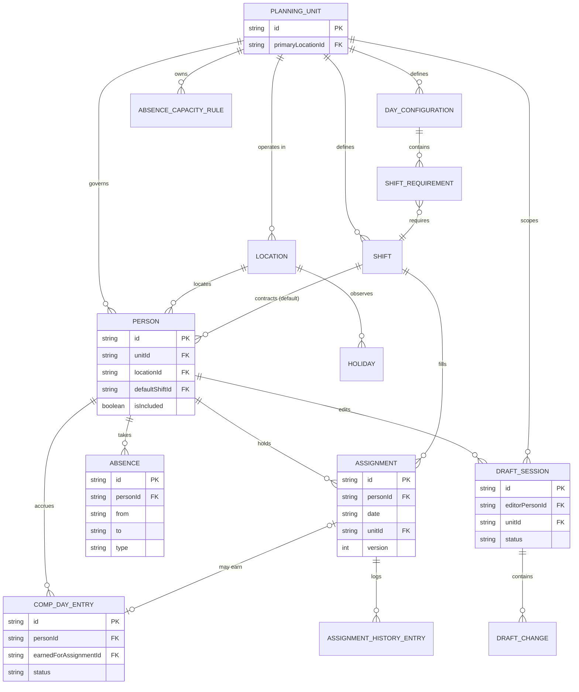
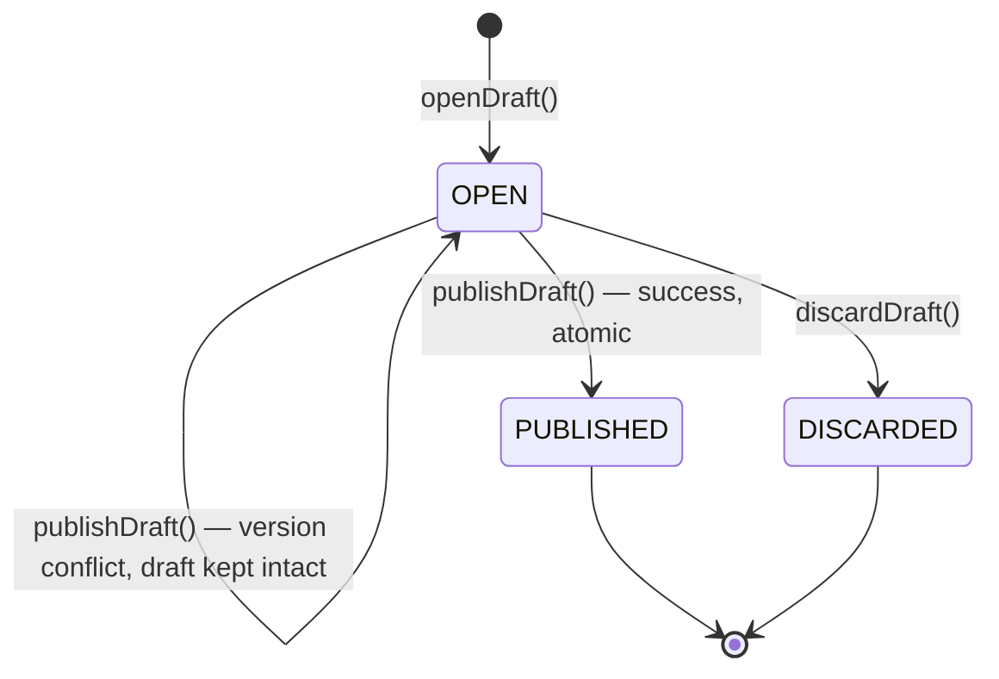
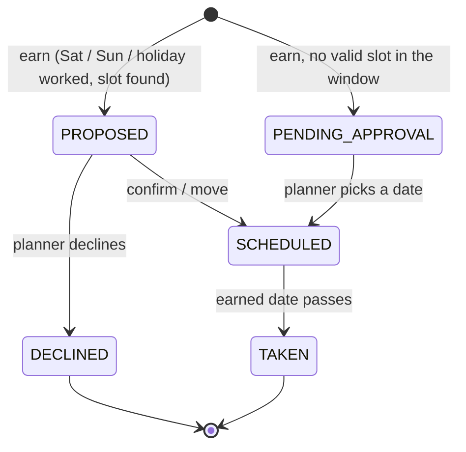

# Domain model

## Single axis: PlanningUnit

The single most important structural decision ([ADR-0032](adr/0032-planning-unit-single-rule-axis.md)): **a planning unit is the sole rule boundary** — which rules apply, whose screen a person appears on, everything.

- **PlanningUnit** answers *which rules apply* and *whose screen this person appears on* — roles, shifts, day configurations, coverage requirements, comp-off policy.

Units come in two kinds:
- **REGION** units: `unit-amer`, `unit-emea`, `unit-apac` — each is a region's roster.
- **CROSS_REGION** units: `unit-st` (Service Transition) — a team drawn from people who sit in different regions' locations, but plans and is staffed as one unit.

A person belongs to exactly one unit (`Person.unitId`) — there is no dual membership. An ST engineer who happens to sit in Hartford is in **unit-st**, full stop: their shifts, eligibility, and coverage all resolve against `unit-st`'s own day configurations (which carry `min=0` — ST coverage is optional, not required; see [ADR-0034](adr/0034-zero-minimum-legal-coverage-state.md)). Their `Location` (Hartford) still governs their calendar and display timezone, independently of which unit they're on — that's the whole point of `Location` and `PlanningUnit` being two separate axes instead of one.

**Coverage is computed per unit.** Absence limits are per unit. Comp-off policy is per unit.

## Relationship overview

```
PlanningUnit  (single rule boundary: unit-amer | unit-emea | unit-apac | unit-st)
 ├─ references Locations (many-to-many)
 ├─ defines Shifts                what work is done, with its own time window
 ├─ defines DayConfigurations    which shifts apply to which group of days
 │    └─ each holds ShiftRequirements  min / max / default per shift
 ├─ owns CompOffPolicy
 └─ owns AbsenceCapacityRules

Location
 ├─ timezone (display)
 └─ holiday calendar + weekend days      → what is non-working for a person

Person
 ├─ belongs to a PlanningUnit    → rules, shifts, coverage, whose screen
 ├─ has a Location and a default Shift
 └─ has ShiftEligibility, availability, constraints, preferences

Assignment            one person + one date + (working shift | roster marker)
 ├─ published, or held as a DraftChange
 ├─ contributes to the computed CoverageSnapshot
 ├─ may earn a CompDayEntry
 └─ has append-only AssignmentHistory

Absence               one person + an inclusive date range + a leave type
CompDayEntry          an accrual with a balance, linked to the earning assignment
Holiday               a date + name + affected locations

DraftSession          one editor + one unit + one period
 └─ ordered DraftChanges → applied atomically on Publish

CellValue             a projection: what the grid shows for (person, date)
```

## Entity relationships

The ASCII sketch above is the narrative; this is the same model as a diagram, with
cardinalities. PlanningUnit is the sole rule axis — that is ADR-0032, not an accident of layout.



## Draft session lifecycle

Full narrative in [03-drafts-and-publication.md](03-drafts-and-publication.md); this is
the same three states as a diagram. A failed publish leaves the session `OPEN` with the
draft intact — never a fourth "conflicted" state, because the draft itself didn't
change, only the verdict on applying it.



## Planning unit

```
PlanningUnit {
  id, name
  kind                  REGION | CROSS_REGION
  primaryLocationId     whose holiday calendar decides "is this a holiday for the rota"
  locationIds[]         many-to-many — Pune hosts amer/emea/apac at once
  groupBy               LOCATION | REGION | ORG_CATEGORY
  compOffPolicy
}
```

Default units: `unit-amer`, `unit-emea`, `unit-apac` (kind `REGION`, grouped by location) and
`unit-st` (kind `CROSS_REGION`, grouped by region).

**A unit is a default filter, not a hard boundary** when displayed on screen — the Schedule screen defaults to
the selected unit's people and offers a toggle to show all people working that unit's shifts. Because every
planner can write anywhere (see Access below), a gap in a shift belonging to another
unit can be fixed without leaving the screen.

Adding a fourth unit — "Automation", "SRE" — is a data change.

## Location

Responsible for exactly two things: the calendar of weekends and public holidays, and
the timezone used to display a person's schedule to them. Nothing to do with shift
timing.

```
Location {
  id, name
  timeZone              IANA
  holidayCalendarKey    'US' | 'GB' | 'CH' | 'SG' | 'IN'
  weekendDays[]         usually [Sat, Sun]
  country
}
```

Known locations: Singapore, Pune, London, Stevenage, Zurich, Chicago, New York,
Hartford.

## Shift

**One entity, one absolute window** ([ADR-0033](adr/0033-one-shift-entity-absolute-window.md)): a shift created as 11:00–20:00 New York is that same absolute interval for everyone holding it, with no location-specific bending.

```
Shift {
  id, unitId
  code                 'Lead', 'Crew', 'Batch-E', 'E', 'BM', 'M', 'Primary'
  label, description   operational purpose, shown in the picker and settings
  color                configuration, not decoration
  hotkey?              unique within the unit
  timeZone, start, end, crossesMidnight
  breakMinutes
  countsAsCoverage
  editableTime
}
```

Shifts belong to a unit ([ADR-0032](adr/0032-planning-unit-single-rule-axis.md)). `ST:AMER` in unit-st and `ST Amer` in unit-amer are separate entities; matching codes across units are
coincidental.

On-call is an ordinary shift code occupying the day, not a parallel duty — see
"Assignment".

### Real shift codes

| Unit | Codes |
|---|---|
| unit-apac | `M`, `G`, `MC` |
| unit-emea | `E`, `BM`, `BM-Lead`, `Shift-Lead`, `MOD`, `CH-Early`, `CH-SL`, `CH-Late`, `CH-OC`, `CH-OC-Mo`, `CH-OC-Ev`, `CH` |
| unit-amer Mon–Thu | `Lead`, `Crew`, `Crew-BC`, `Batch-E`, `Batch-L`, `Batch-U`, `Cover`, `ST Amer` |
| unit-amer Friday | `Lead-E`, `Crew-E`, `Crew-L`, `Batch-E`, `Batch-L`, `Cover` |
| unit-amer weekend | `Primary`, `Secondary`, `ST`, `Shadow`, `BCM` |
| unit-st | `ST:AMER`, `ST:EMEA`, `ST:APAC` |

**`Cover` is engineering work**, not spare capacity: incident and alert coverage,
automation, improvement work, and **in-hours training**. A person on `Cover` is at
work. This is why training is not an absence.

## Day configuration

**Different day groups carry different shift sets, not just different minimums**
([ADR-0016](adr/0016-day-configuration-groups.md)). AMER Monday–Thursday has `Lead` and
`Crew`; Friday has `Lead-E`, `Crew-E` and `Crew-L` — different shifts, not different
counts.

```
DayConfiguration {
  id, unitId
  key                  'weekday' | 'friday' | 'weekend' | 'holiday' | 'date'
  weekdays[]           for weekday-style groups
  date?, label?        for a one-off group — deferred, see below
  shiftRequirements[]
  effectiveFrom        see "Effective dating"
}

ShiftRequirement {
  shiftId
  min                  hard requirement; below it is a gap. Zero is legal ([ADR-0034](adr/0034-zero-minimum-legal-coverage-state.md))
  max?                 above it is a warning
  isDefault            offered in the picker even without a requirement
  timingOverride?      this shift runs at a different time on this day group
}
```

Resolution for a date, most specific first: `date` → `holiday` → `weekend` → the
weekday group containing that weekday.

> **`date` configurations are deferred.** For a DR test or month-end close the planners
> simply know the event is happening and staff up. Distinct minimums for an event are a
> custom case and are not built now. The variant stays in the type; no UI, no fixtures.
> ([ADR-0008](adr/0008-events-are-dated-coverage-rules.md))

### Real coverage minimums

| Day group | Requirements (`min`/`max`) |
|---|---|
| unit-amer Mon–Thu | Lead 1/1, Crew 1/∞, Batch-E 1/1, Batch-L 1/1, Cover 0/3, Crew-BC 0/1, Batch-U 0/1 |
| unit-amer Friday | Lead-E 1/1, Crew-E 1/3, Crew-L 1/1, Batch-E 1/1, Batch-L 1/1 |
| unit-amer weekend | Primary 1/1, Secondary 0/1, ST 0/1 |
| unit-emea weekday | Shift-Lead or BM-Lead 1/2, BM 1/∞, E 1/∞ |
| unit-apac weekday | M 1/∞ |
| unit-st all | All shifts 0/∞ (zero-minimum, optional coverage) |

## Effective dating

Coverage requirements, shifts and day configurations are **versioned with an effective
date** ([ADR-0021](adr/0021-effective-dated-configuration.md)). Raising a minimum today
must not turn last March red: March was closed against the rule in force in March.

Coverage for a date always resolves the configuration version whose effective range
contains that date. Settings edits create a new version from a chosen effective date;
they never mutate the previous one.

## Person

```
Person {
  id                        stable; history stays attached to it
  displayName, initials, employeeId?
  unitId                    rules, coverage, whose screen
  locationId, defaultShiftId
  orgCategory               SUPPORT | SERVICE_TRANSITION | MANAGEMENT
  isActive                  deactivation ≠ deletion
  isIncluded                participates in planning at all
  eligibility[]
  availableWeekdays[]
  defaultShiftId?           the ordinary-day default used by auto-populate
  weekendEligible
  constraints  { minRestHours, maxConsecutiveDays, maxWeekendsPerQuarter }
  preferences  { avoidsWeekdays[], preferredPartnerIds[], blackoutDates[] }
  calendarToken
}
```

**There is no separate work-pattern entity**
([ADR-0005](adr/0005-no-work-pattern-entity.md)). `defaultShiftId` and
`availableWeekdays` are person fields consumed only by auto-populate; they never
override an explicit assignment.

`orgCategory` is a reporting and grouping attribute. Managers are
`orgCategory = MANAGEMENT` with `isIncluded = false`, which keeps them in the roster
and out of the planning rows.

```
ShiftEligibility {
  shiftId
  targetShare          desired share of this person's workload, 0..1
  minPerWeek?, maxPerWeek?
}
```

Eligibility stores a **target share, not a boolean**
([ADR-0006](adr/0006-eligibility-target-shares.md)). A shift absent from the list means
"not eligible"; the boolean case is a degenerate instance.

## Assignment

One person, one date, and either a working shift or a roster marker.

```
Assignment {
  id
  personId, date            date is local to the shift's timezone
  unitId                    denormalized from the person's unit
  content                   { kind: 'SHIFT',   shiftId, timeOverride? }
                          | { kind: 'MARKER', marker: 'OFF' | 'NOT_SCHEDULED' }
  isWeekend                 by the person's location calendar
  note?
  source                    MANUAL | GENERATED | IMPORTED
  version                   optimistic concurrency token
  createdBy, createdAt, updatedBy, updatedAt
}
```

**Exactly one assignment per (person, date).** A person is never on two duties the same
day — including on-call, which is an ordinary shift code occupying the day like any
other. This is a hard uniqueness constraint, not a soft rule.

`OFF` is the spreadsheet's `Off` / `W-Off`: a planned day off. `NOT_SCHEDULED` is `0`:
an explicit "no duty", used for weekends in the monthly matrices. Neither is leave, and
both differ from an empty cell, which means **no decision recorded**.

## Absence

Leave is a **range**, and the range is the source of truth
([ADR-0017](adr/0017-absence-range-cell-projection.md)): it arrives from the corporate
system as a range, and simultaneous-absence limits are computed over ranges.

```
Absence {
  id, personId
  type                  VACATION | SICK | OTHER
  from, to              inclusive
  source                IMPORT | MANUAL
  importBatchId?, lastSeenInImportAt?
  syncedToHrAt?
  note?
}
```

**Training is not an absence.** In-hours training and other engineering activity is the
`Cover` shift — the person is at work. A `Training` value in a historical spreadsheet
maps to `Cover`, not to leave, and therefore counts toward coverage.

`lastSeenInImportAt` detects records that vanished from a later export. Import never
overwrites a `MANUAL` record.

## Comp day

An **accrual with a balance**, not a calendar event
([ADR-0007](adr/0007-comp-day-as-balance.md)). **Comp days do not expire.** Full
mechanics in [05-comp-days.md](05-comp-days.md).

```
CompOffPolicy {
  windowBeforeDays, windowAfterDays      search window around the earned date
  excludedWeekdays[]                     default: Monday, Friday
  agingThresholdDays                     configurable; past it, the entry is flagged
  requiresApprovalWhenNoSlot             true
}

CompDayEntry {
  id, personId
  earnedForAssignmentId, earnedForDate
  proposedDate                           nearest free eligible date in the window
  actualDate?                            after the planner moves it
  status    PROPOSED | SCHEDULED | TAKEN | DECLINED | PENDING_APPROVAL
  syncedToHrAt?
}
```

Saturday and Sunday are two independent earning events and may produce two entries.

Full mechanics, including the window search, live in
[05-comp-days.md](05-comp-days.md); this is the same status machine as a diagram. No
terminal expiry state — `TAKEN` and `DECLINED` are the only ends, and an entry with no
valid slot in its window goes to `PENDING_APPROVAL` rather than being dropped.



## Holiday

```
Holiday { id, date, name, locationIds[], isFullDay }
```

A holiday says nothing about who works. One person may show `PH` while another holds a
shift on the same date. Holiday definition and holiday coverage stay separate.

## Cell value — the projection

The grid renders one value per (person, date), derived from the entities above. This
projection is the single place where precedence lives.

```
CellValue =
  | { kind: 'SHIFT',   shift, assignment }
  | { kind: 'STATUS', status: 'OFF' | 'NOT_SCHEDULED' | 'PH'
                            | 'COMP_OFF' | 'VACATION' | 'SICK' | 'OTHER' }
  | { kind: 'EMPTY' }                            no decision recorded
```

Precedence, first match wins:

1. an `Assignment` with a working shift — a person can be scheduled on a holiday or a
   weekend, and that must win over any non-working signal;
2. an `Absence` covering the date;
3. a `CompDayEntry` that is `SCHEDULED` or `TAKEN` on the date;
4. a `Holiday` affecting the person's location → `PH`;
5. an `Assignment` with a marker → `OFF` / `NOT_SCHEDULED`;
6. otherwise `EMPTY`.

When rule 1 fires and rule 2, 3 or 4 would also have fired, the cell additionally
carries a **conflict** — see
[04-coverage-and-validation.md](04-coverage-and-validation.md). A `PROPOSED` comp day is
drawn as a dashed hint over an empty cell; it does not yet occupy the day.

## Coverage snapshot

Computed, never stored by hand. For one unit and date: filled count per shift, gaps,
conflicts, headcount, total required, total filled. Recomputed after every draft change
and authoritatively rechecked on publish.

**Coverage is computed per unit.** A gap in `ST:AMER` appears
in the unit-st coverage strip — the requirement belongs to the unit, and anyone may fix it.

## Draft session

```
DraftSession {
  id, editorPersonId, unitId
  from, to                       the period being edited
  status                         OPEN | PUBLISHED | DISCARDED
  createdAt, updatedAt
}

DraftChange {
  id, sessionId, seq
  op                             CREATE | UPDATE | DELETE
  targetType                     ASSIGNMENT | ABSENCE | COMP_DAY
  targetId?
  before, after                  full values, so the change is reversible
  at
}
```

One open session per (editor, unit) with an overlapping period. Different planners may
hold overlapping drafts; the conflict is resolved on publish, not prevented up front
([ADR-0015](adr/0015-optimistic-drafts-and-publication.md)). Lifecycle in
[03-drafts-and-publication.md](03-drafts-and-publication.md).

## Absence capacity rule

A limit on simultaneous absences, checked when leave is approved rather than when
shifts are planned. **The shift-pool limit matters more than the overall one**
([ADR-0010](adr/0010-absence-limits-by-role-pool.md)): three of the four people who can
lead being out at once is a problem a headcount counter never sees.

```
AbsenceCapacityRule {
  id, unitId
  scope                 UNIT | SHIFT_POOL(shiftId)
  durationBucket        SHORT | LONG
  longThresholdWorkdays 5
  maxConcurrent
  countsTypes[]
}
```

Confirmed defaults: at most **3 long** and **4 short** absences per unit. Shift-pool
limits are configurable; the critical lead-type pools are seeded at 1 as an
`ASSUMPTION`.

## Handover

Not a stored entity. A handover between units is the intersection of two units'
shift windows on the timeline, computed on the fly by `engine/timeline.ts`
(`Handover { fromUnitId, toUnitId, ... }`, a view-layer type, not a domain entity).
Storing it separately would let it drift from reality on the first DST transition —
the two units' actual windows are the source of truth, not a cached overlap.

## Access and audit

```
AssignmentHistory { id, assignmentId, action, snapshot, actorId, at }   append-only
Acknowledgement   { issueKey, comment, byPersonId, at }
```

Three application roles, and **no regional scoping**
([ADR-0032](adr/0032-planning-unit-single-rule-axis.md)):

| Role | Can |
|---|---|
| Viewer | Read published data |
| Planner | Draft and publish in **any** unit |
| Admin | Everything a planner can, plus configuration and force-publish |

The team is small and nobody edits another team's rota without reason. The control is
**a complete audit trail**, not a permission matrix: every published change records who
made it, when, and what the previous value was. This removes unit-scope claims,
cross-unit permission checks entirely.
