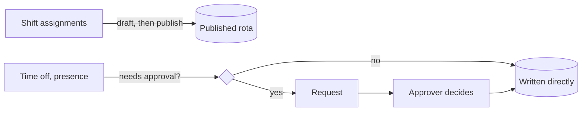

# Workflows — who does what, and how it gets recorded

The other documents describe entities and screens. This one describes **what people do**,
end to end, and which role each step needs. If a screen and this page disagree, this page
is wrong — say so and fix it.

## The four roles

Roles are a **set**, granted per planning unit, with no ordering between them
([ADR-0051](adr/0051-roles-are-a-scoped-set.md)). Holding two grants both. A grant names a
unit, or is global (every unit, plus the configuration that belongs to none).

| Role | Can | Cannot |
|---|---|---|
| `Viewer` | Read the rota. Record their own presence, ask for their own time off, move their own comp days, read any cell's history. **Everyone signed in.** | Touch anybody else's row |
| `Planner` | Shifts, painting, drafts, publishing, in units they hold it for. Record office/travel presence for their unit's people, and raise requests on their behalf | **Approve anything**, including leave they raised themselves |
| `Approver` | Decide requests raised by people in units they hold it for | Touch the rota |
| `Admin` | Configuration and role grants, in units they hold it for. A global grant also covers locations, holidays, units, event and request types | **Assign shifts** |

An Admin being unable to plan is the point, not an oversight: policies used to compare
roles by ordinal, so `Admin > Planner` made every administrator a planner of every unit — a
right nobody granted and nobody could withhold.

## Two write paths

What decides which path something takes is **the thing being written**, never who is
writing it ([ADR-0052](adr/0052-two-flows-drafts-for-shifts-approval-for-everything-else.md)).

A draft's value is review before something becomes real, by the person staging the batch.
Time off already has a review step — approval — and it is a better one, because it names
the human who decided.

---

## Planning a rota

**Who:** a `Planner` of the unit.

1. **Open Schedule**, pick the unit and the period. The window runs forward from the
   selected day; `‹ ›` walk a day at a time, `« »` a month.
2. **Paint.** Right-click a cell for the shifts in that day's configuration this person is
   eligible for, or pick one in the palette and drag. **The first edit opens the draft by
   itself** — there is no Edit mode ([ADR-0023](adr/0023-editing-arms-itself.md)).
3. **Generate** fills what is left and ranks candidates, as a preview you accept or
   discard ([06-generation.md](06-generation.md)).
4. **Watch coverage and issues.** Gaps, conflicts and warnings are all visible and none of
   them blocks ([ADR-0035](adr/0035-only-blocking-blocks.md)): they are decisions still to
   be made, not corrupt data. Only a double assignment or an unknown shift is `BLOCKING`.
5. **Publish.** One atomic transaction. A version conflict returns 409 with a typed diff
   and **the draft survives** — a failed publish never clears your work.

A draft is resumed, not recreated: reloading the page or acting as somebody else and back
returns you to the same draft with the same staged changes. Concurrent drafts by *different*
planners are allowed and resolve at publish; the cells another planner is holding an
unpublished edit on are **hatched in grey**, and the tooltip names them. Nothing is locked
— the banner saying somebody else had the period open was true and useless, and naming the
cells is what lets the second planner work somewhere else.

## Looking at your own months

**Who:** anybody, about themselves ([ADR-0055](adr/0055-a-personal-calendar-and-a-feed.md)).

**My calendar** is one person's months, vertically, growing as you scroll. A day is a box
with room for the shift code and its hours, so it reads without decoding. Right-click a day
— or drag across several — and it is the **same menu** the grid's cells offer: one set of
rules about what needs approving, one route per thing.

Months with no shifts in them are normal. A rota that has not been published yet is not an
error, and leave can be booked on a day that has no shift.

Managers get no special view here: a manager is an ordinary person with their own calendar,
and looking at the team is what Schedule is for.

**Subscribing.** The sidebar carries the address of a personal iCalendar feed — shifts as
timed events, leave and comp days as whole days — for Outlook, Google or anything else that
subscribes by URL. That address is a **credential**: it is the only thing standing between a
subscriber and the schedule, because a calendar client cannot carry a token any other way.
So it is 256 bits, it is never on any list payload, and **Reset the address** revokes it,
which is the button you need the day somebody pastes the link into a shared document.

## Asking for time off

**Who:** anybody, about themselves. A `Planner` of your unit may raise one on your behalf —
and it is still a request, because needing approval is a property of the leave, not of who
asked.

1. Right-click your own row → **Time off** → the kind.
2. `requiresApproval` on that kind decides. Annual leave, sick leave, floating holiday,
   personal days, unpaid leave, furlough → a request. **Not available** → written directly,
   because it is a declaration of availability rather than a request for time.
3. The cell shows the request **dashed** until somebody decides. A proposal must never read
   as a fact. On a day already closed out by leave the menu drops the presence section —
   "working from home" while on vacation is not something you record — and offers the leave
   kinds as **Change to**, because changing the kind is a new request that supersedes the
   old one.
4. An `Approver` of your unit decides. If your unit has no approver configured it falls
   through to the admins — a request must never resolve to nobody, because an empty inbox
   is the failure nobody notices.
5. On approval the `Absence` is written and the cell stops being dashed. `APPROVED` and
   `APPLIED` are separate states: approval is a human decision, application is a write that
   can fail, and a failure notifies both of you.

Sickness needs approval like anything else, and still does not count toward the
simultaneous-absence limit — flagging a team because three people fell ill helps nobody.

## Recording where you work

**Who:** anybody, about themselves; a `Planner` of the unit for others.

Which options the menu offers, what they are called and what they draw is a row on
Settings → Presence ([ADR-0053](adr/0053-presence-types-are-reference-data.md)). So is
whether each one needs signing off:

- **Office, travel, customer site** — written directly, as seeded. Statements of fact.
- **Remote** — a request, for everybody including planners.

That is a default and not a rule. `requiresApproval` on the presence type is what decides,
the server enforces it the same way it enforces a leave type's, and a team that trusts
remote days unticks one box. Adding a way of working is a row too
([ADR-0054](adr/0054-presence-types-are-an-open-set.md)): "on standby", "at a conference",
"a customer's office". Two columns carry what used to be code — whether recording it names
one of our offices, and which of on-site / remote / away it counts toward on the coverage
strip.

Anything recorded can be taken back. Right-click the cell and **Clear what is recorded** —
a day could be overwritten but not removed, which made half a Saturday marked by accident
permanent.

Presence never touches coverage: a remote person on `Crew` covers `Crew`
([ADR-0043](adr/0043-presence-is-an-orthogonal-range-entity.md)). Every recorded day is
drawn in the cell's band, coloured by kind and quieter when it matches the person's
baseline.

## Taking a comp day

**Who:** the person who earned it, or a `Planner` of their unit on their behalf. Approved
by an `Approver`.

1. A weekend or holiday shift **accrues** a comp day when the draft is published. It is
   linked to the assignment that earned it, so "where did this day off come from" always
   has an answer.
2. The system **proposes** a date from the unit's comp-off policy: the earliest free
   eligible day in the search window, excluding Mondays and Fridays by default.
3. The person opens the comp day from the grid and **asks for a day** — the proposal, or
   any other day the policy allows. `CompDayPlacement.Check` decides what is allowed, and
   the same rules drive what the client offers and what the server accepts. **At most one
   request stays live per comp day** ([ADR-0056](adr/0056-one-live-comp-day-request.md)):
   asking again cancels the earlier one, so an approver's inbox is never asked to decide
   between two proposals for the same day off.
4. Asking does not move the day. An approver signs it off, and only then is the date set
   and the day blocked.

Comp days never expire. `agingThresholdDays` flags anything outstanding too long.

## Deciding requests

**Who:** an `Approver` of the subject's unit.

Requests reach you two ways: the **Requests** screen, grouped by person, and the cell
itself — right-click a dashed cell and the decision buttons are there, covering every
pending request the selection touches.

Approve, decline, or return with a comment. A returned request goes back to the requester
with the comment attached, still visible to everyone who has seen it. Every decision is an
append-only row: "who approved this and what did they say" survives every later state
change.

## Administering

**Who:** an `Admin` of the unit; a **global** `Admin` for anything that belongs to no unit.

Settings is hidden from anyone who administers nothing — every tab on it is configuration.
The one thing that was *not* configuration, the display timezone, is a click on the clocks
in the header.

| Tab | Scope |
|---|---|
| Units, Shifts, Day configs, Absence limits | The unit |
| Locations, Holidays, People | Global |
| Holidays → Import from a calendar | Any published iCalendar feed. **Adds, never removes**, so running it again next year is safe |
| Leave types | Global — a kind of leave means the same in every unit |
| Presence | Global — same reason. Retire with Offered off; delete is refused once anything points at the type |
| Roles | The unit; a global grant needs a global admin |
| Maintenance | Global — it replaces the whole system's content |

Settings tabs that need a **global** grant say so and **name who holds it** — one seeded
administrator is easy to miss among twenty-seven people, and "you need a global admin" with
no way to find one is not an answer.

Granting is itself scoped: a unit's admin manages that unit's grants, and only a global
admin can make a global one — otherwise any unit admin could promote themselves out of
their unit. Revoking the last global admin is refused, since nothing else could grant it
back. Every grant writes a history row: "who made them an approver" is the first question
after a bad approval.

## Starting a system

**Who:** whoever opens it first — and after that, a **global** `Admin`.

This is the one workflow with no role requirement, because before it runs there is nobody
to hold a role ([ADR-0059](adr/0059-setup-is-a-screen-not-a-flag.md)). A database with no
`SystemSetup` row answers `503 SETUP_REQUIRED` to everything but `/health/*`,
`/api/setup/*` and the OpenAPI document, and the browser shows a wizard instead of the
product:

| Preset | What it writes |
|---|---|
| **Bare** | One location, one planning unit, and you — global `Admin`, created from your own token's name and email. Shifts, day configurations and the rest of the roster are entered on Settings afterwards |
| **Demo** | The fixture entire: four units, a trimmed roster, shifts, day configurations and a sample rota. Your email is linked to the seeded global admin so you can sign back in |

Outside stub mode the name and email come from the caller's token and **anything sent in
the body is ignored** — a typo there would produce a system whose only administrator
cannot sign in. Stub mode has no claims to read, so it is the one path that asks.

It runs **once**: a second `POST /api/setup` answers `409 SETUP_COMPLETE`, guarded by a
fixed primary key rather than by the check that precedes it, so two simultaneous callers
cannot both succeed. Trusting the first visitor is deliberate — the window between first
boot and setup is minutes, in Entra mode they still have to hold a valid tenant token, and
`SystemSetup` records who did it and when.

Afterwards, **Settings → Maintenance** carries the same two operations:

- **Load demo data**, offered only while nobody has added a person or scheduled anything —
  the fixture has fixed ids, and merging it into a system somebody has typed real data into
  produces a roster nobody can reason about. Shown disabled with the reason, not hidden.
- **Reset to empty**, confirmed by typing the environment name. It deletes rows in
  dependency order and returns to *migrated and empty* — never a dropped database — so the
  next visit is the wizard again.

## What is always true

- **The acting person comes from the token**, never a request body
  ([ADR-0039](adr/0039-actor-identity-from-the-token.md)). Otherwise the audit trail would
  be forgeable by the people it constrains.
- **Every write leaves a history row**
  ([ADR-0040](adr/0040-one-change-history-for-every-entity.md)). A new write path with no
  history row is a bug.
- **Any cell's history is readable by everyone.** "Who changed this, and when did the
  request come in" is not a privileged question, and answering "who got there first" needs
  one ordered stream rather than two lists.
- **Nothing AI-driven writes to published data**
  ([ADR-0048](adr/0048-ai-explains-the-plan-never-decides-it.md)). The model phrases a
  digest that Application already computed.
